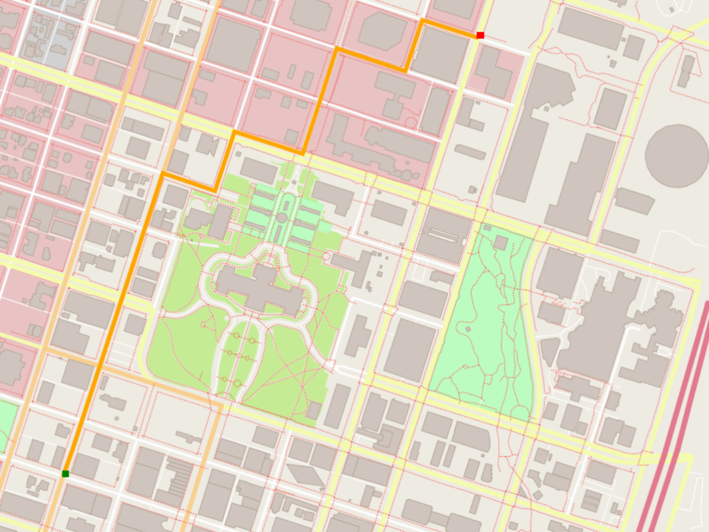

# Route Planning Project

A project which demonstrates the use of A* algorithm to find the shortest path between two points on the map.




## Dependencies for Running Locally
* cmake 3.11.3
* make 4.1 (Linux)
* gcc/g++ 7.4.0
* [IO2D]https://github.com/cpp-io2d/P0267_RefImpl/blob/master/BUILDING.md

Tested on Ubuntu 22.04

IO2D installation instruction for Ubuntu

```
sudo apt update
sudo apt install build-essential
sudo apt install cmake
sudo apt install libcairo2-dev
sudo apt install libgraphicsmagick1-dev
sudo apt install libpng-dev

git clone --recurse-submodules https://github.com/cpp-io2d/P0267_RefImpl
cd P0267_RefImpl
mkdir Debug
cd Debug
cmake --config Debug "-DCMAKE_BUILD_TYPE=Debug" ..
cmake --build .
sudo make install
```
 

## Compiling and Running

### Compiling
create a `build` directory and change to that directory:
```
mkdir build && cd build
```

From within the `build` directory, run `cmake` and `make`:
```
cmake ..
make
```

### Running
The executable will be placed in the `build` directory. From within `build`, run the project as follows:
```
./OSM_A_star_search
```
Or to specify a map file:
```
./OSM_A_star_search -f ../<your_osm_file.osm>
```
